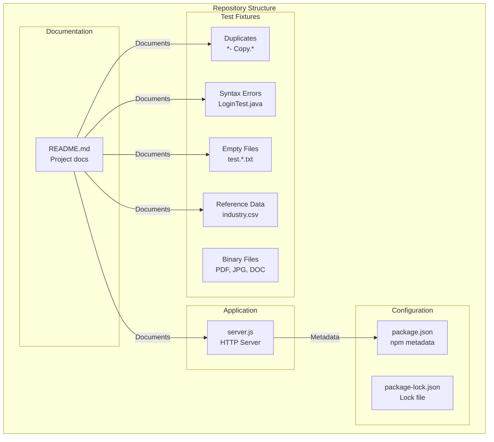
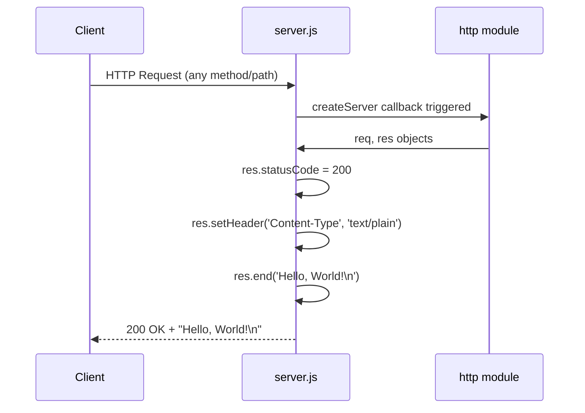
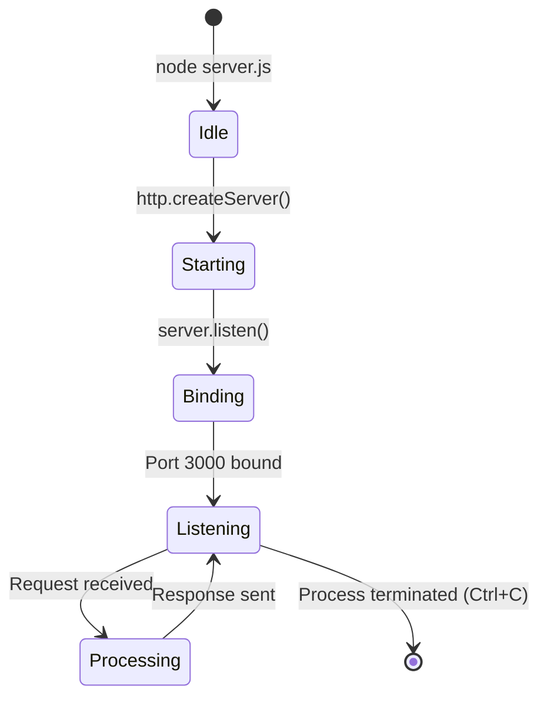

# hao-backprop-test

A Backprop integration test fixture containing a minimal Node.js HTTP server and various test artifacts for multi-format analysis testing.

> ⚠️ **IMPORTANT NOTICE**
>
> **This is a test project for Backprop integration. Do not touch!**
>
> This repository serves as a stable test fixture for integration testing. All files, including intentional duplicates, syntax errors, and empty files, are deliberately configured for testing purposes. **Do not modify any files** as changes may break integration tests.

## Table of Contents

- [Prerequisites](#prerequisites)
- [Installation](#installation)
- [Quick Start](#quick-start)
- [API Reference](#api-reference)
- [Project Structure](#project-structure)
- [Test Fixture Collection](#test-fixture-collection)
- [Configuration](#configuration)
- [Technical Details](#technical-details)
- [License](#license)
- [Author](#author)

## Prerequisites

Before running this project, ensure you have the following installed:

| Requirement | Version | Notes |
|-------------|---------|-------|
| Node.js | v16+ (any modern LTS) | Required for server execution |
| npm | v7+ | Required for lockfileVersion 3 compatibility |

> **Note:** This project has **zero external dependencies**. No `npm install` is required.

## Installation

Clone the repository to your local machine:

```bash
git clone <repository-url>
cd hao-backprop-test
```

No additional installation steps are needed. The project uses only Node.js built-in modules.

## Quick Start

Start the HTTP server:

```bash
node server.js
```

**Expected output:**

```
Server running at http://127.0.0.1:3000/
```

Test the server using curl:

```bash
curl http://127.0.0.1:3000
```

**Expected response:**

```
Hello, World!
```

Or open `http://127.0.0.1:3000` in your web browser.

## API Reference

The HTTP server provides a single endpoint that responds identically to all requests.

### Endpoint Details

| Property | Value | Source |
|----------|-------|--------|
| URL | `http://127.0.0.1:3000` | `server.js:3-4` |
| Hostname | `127.0.0.1` (localhost only) | `server.js:3` |
| Port | `3000` | `server.js:4` |
| Response Status | `200 OK` | `server.js:7` |
| Content-Type | `text/plain` | `server.js:8` |
| Response Body | `Hello, World!\n` | `server.js:9` |

### Request Handling

- **Methods Accepted:** All HTTP methods (GET, POST, PUT, DELETE, PATCH, OPTIONS, etc.)
- **Paths Accepted:** All paths return the identical response
- **Request Body:** Ignored
- **Query Parameters:** Ignored

### Example Requests

**Using curl:**

```bash
# GET request
curl http://127.0.0.1:3000

# POST request (same response)
curl -X POST http://127.0.0.1:3000

# Request to any path (same response)
curl http://127.0.0.1:3000/any/path/here
```

**Using JavaScript:**

```javascript
fetch('http://127.0.0.1:3000')
  .then(response => response.text())
  .then(data => console.log(data)); // Output: Hello, World!
```

### Server Code

```javascript
// Source: server.js:1-14
const http = require('http');

const hostname = '127.0.0.1';
const port = 3000;

const server = http.createServer((req, res) => {
  res.statusCode = 200;
  res.setHeader('Content-Type', 'text/plain');
  res.end('Hello, World!\n');
});

server.listen(port, hostname, () => {
  console.log(`Server running at http://${hostname}:${port}/`);
});
```

## Project Structure

This repository contains 12 text-based files and 6 binary files organized in a flat directory structure:

### Text-Based Files

| File | Type | Description |
|------|------|-------------|
| `README.md` | Documentation | Project overview and usage guide |
| `server.js` | JavaScript | Primary HTTP server implementation (14 lines) |
| `server - Copy.js` | JavaScript | Duplicate server file (test fixture) |
| `package.json` | JSON | npm package metadata and configuration |
| `package-lock.json` | JSON | Dependency lock file (empty - zero dependencies) |
| `LoginTest.java` | Java | Java stub with intentional syntax error at line 7 |
| `LoginTest - Copy.java` | Java | Duplicate Java file (test fixture) |
| `industry.csv` | CSV | Reference data with 44 industry labels |
| `industry - Copy.csv` | CSV | Duplicate CSV file (test fixture) |
| `test.py.txt` | Text | Empty file (0 bytes) - edge case testing |
| `test.py - Copy.txt` | Text | Empty duplicate file (0 bytes) |
| `test.txt.txt` | Text | Empty file (0 bytes) - edge case testing |

### Binary Files

| File | Type | Description |
|------|------|-------------|
| `100Pages.pdf` | PDF | Multi-page PDF test fixture |
| `100Pages - Copy.pdf` | PDF | Duplicate PDF (test fixture) |
| `demo.jpg` | Image | JPEG image test fixture |
| `demo - Copy.jpg` | Image | Duplicate JPEG (test fixture) |
| `sample.doc` | Document | Microsoft Word document test fixture |
| `sample - Copy.doc` | Document | Duplicate Word document (test fixture) |

## Test Fixture Collection

This repository is specifically designed as a **Backprop integration test fixture**. Each file serves a deliberate purpose in testing various scenarios.

### Duplicate Detection Testing

The following files are **intentional duplicates** for testing duplicate detection algorithms:

| Original File | Duplicate File | Purpose |
|---------------|----------------|---------|
| `server.js` | `server - Copy.js` | JavaScript duplicate detection |
| `LoginTest.java` | `LoginTest - Copy.java` | Java duplicate detection |
| `industry.csv` | `industry - Copy.csv` | CSV duplicate detection |
| `test.py.txt` | `test.py - Copy.txt` | Empty file duplicate detection |
| `100Pages.pdf` | `100Pages - Copy.pdf` | PDF binary duplicate detection |
| `demo.jpg` | `demo - Copy.jpg` | Image binary duplicate detection |
| `sample.doc` | `sample - Copy.doc` | Document binary duplicate detection |

### Syntax Error Testing

**File:** `LoginTest.java`

This Java file contains an **intentional syntax error** at line 7 for testing error handling validation:

```java
// Source: LoginTest.java:1-12
package com.blitzyTest;

public class LoginTest {

	public static void main(String[] args) {

      Web  // <-- Invalid token (intentional syntax error)
		
		
	}

}
```

> **Note:** The invalid `Web` token on line 7 is intentional and should NOT be fixed. It tests how systems handle Java compilation errors.

### Empty File Testing

The following files are **0-byte empty files** for edge case testing:

| File | Purpose |
|------|---------|
| `test.py.txt` | Empty file handling |
| `test.py - Copy.txt` | Empty duplicate handling |
| `test.txt.txt` | Empty file with double extension |

### Reference Data

**File:** `industry.csv`

Contains 44 industry labels for validation and parsing tests:

```csv
Industry
Accounting/Finance
Advertising/Public Relations
Aerospace/Aviation
Arts/Entertainment/Publishing
Automotive
Banking/Mortgage
Business Development
Business Opportunity
Clerical/Administrative
Construction/Facilities
Consumer Goods
Customer Service
Education/Training
Energy/Utilities
Engineering
Government/Military
Green
Healthcare
Hospitality/Travel
Human Resources
Installation/Maintenance
Insurance
Internet
Job Search Aids
Law Enforcement/Security
Legal
Management/Executive
Manufacturing/Operations
Marketing
Non-Profit/Volunteer
Pharmaceutical/Biotech
Professional Services
QA/Quality Control
Real Estate
Restaurant/Food Service
Retail
Sales
Science/Research
Skilled Labor
Technology
Telecommunications
Transportation/Logistics
Other
```

## Configuration

### package.json Overview

```json
{
    "name": "hello_world",
    "version": "1.0.0",
    "description": "Hello world in Node.js",
    "main": "index.js",
    "scripts": {
        "test": "echo \"Error: no test specified\" && exit 1"
    },
    "author": "hxu",
    "license": "MIT"
}
```

### Configuration Fields

| Field | Value | Description |
|-------|-------|-------------|
| `name` | `hello_world` | npm package name |
| `version` | `1.0.0` | Semantic version |
| `description` | `Hello world in Node.js` | Package description |
| `main` | `index.js` | Entry point (see known discrepancy below) |
| `scripts.test` | `echo "Error: no test specified" && exit 1` | Placeholder test script |
| `author` | `hxu` | Package author |
| `license` | `MIT` | Open source license |

### Known Discrepancies

> ⚠️ **Entry Point Mismatch**
>
> The `main` field in `package.json` specifies `index.js`, but **`index.js` does not exist** in this repository.
>
> **Actual entry point:** `server.js`
>
> To run the server, use: `node server.js` (not `npm start`)

### package-lock.json

The lock file uses `lockfileVersion: 3` (npm v7+) and contains **no resolved dependencies**, confirming this project has zero external npm packages.

## Technical Details

### Architecture Overview



### HTTP Request/Response Flow



### Server Lifecycle



### Design Decisions

| Decision | Rationale |
|----------|-----------|
| Localhost binding only (`127.0.0.1`) | Security: prevents external network access |
| Fixed port `3000` | Simplicity: no configuration needed |
| No request routing | Minimal implementation for testing |
| No error handling | Intentionally simple; errors surface clearly |
| Zero dependencies | Reduces complexity; uses only Node.js built-ins |
| Flat directory structure | All files in root for fixture simplicity |

## License

This project is licensed under the **MIT License**.

```
MIT License

Copyright (c) hxu

Permission is hereby granted, free of charge, to any person obtaining a copy
of this software and associated documentation files (the "Software"), to deal
in the Software without restriction, including without limitation the rights
to use, copy, modify, merge, publish, distribute, sublicense, and/or sell
copies of the Software, and to permit persons to whom the Software is
furnished to do so, subject to the following conditions:

The above copyright notice and this permission notice shall be included in all
copies or substantial portions of the Software.

THE SOFTWARE IS PROVIDED "AS IS", WITHOUT WARRANTY OF ANY KIND, EXPRESS OR
IMPLIED, INCLUDING BUT NOT LIMITED TO THE WARRANTIES OF MERCHANTABILITY,
FITNESS FOR A PARTICULAR PURPOSE AND NONINFRINGEMENT. IN NO EVENT SHALL THE
AUTHORS OR COPYRIGHT HOLDERS BE LIABLE FOR ANY CLAIM, DAMAGES OR OTHER
LIABILITY, WHETHER IN AN ACTION OF CONTRACT, TORT OR OTHERWISE, ARISING FROM,
OUT OF OR IN CONNECTION WITH THE SOFTWARE OR THE USE OR OTHER DEALINGS IN THE
SOFTWARE.
```

## Author

**hxu**

*Source: `package.json:author`*

---

> **Reminder:** This is a test fixture repository. Please do not modify any files.
